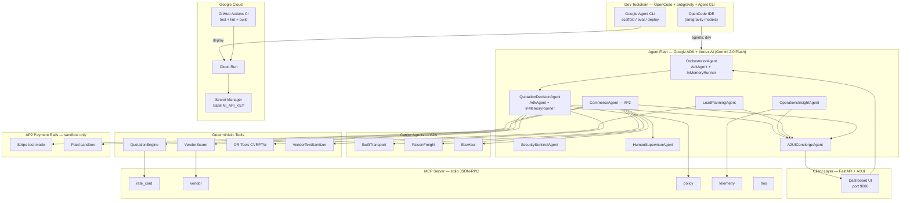

# Architecture — 3PL Multi-Agent Optimization System

## Principle

**A production-grade multi-agent system** built with **OpenCode** (antigravity IDE),
**antigravity models**, **Google ADK**, **Google Agent CLI**, and **Google Cloud**.

Eight specialized agents collaborate over **A2A** (agent-to-agent), **AP2** (Agent Payments
Protocol), and **A2UI** (agent-to-UI), reasoning on **Vertex AI (Gemini 2.0 Flash)**, calling
tools over **MCP**, and deployable to **Cloud Run** via the **Agent CLI**.

The governing rule: **LLMs orchestrate, deterministic Python tools compute.**
All money math, vendor ranking, routing, and compliance thresholds live in plain Python — never
in an LLM.

---

## Development Environment

| Tool                           | Version / detail                                     | Role                                                             |
| ------------------------------ | ---------------------------------------------------- | ---------------------------------------------------------------- |
| **OpenCode** (antigravity IDE) | latest                                               | Primary IDE — agentic coding, refactoring, test generation       |
| **Antigravity models**         | claude-sonnet-4 / latest                             | LLM backbone for all OpenCode dev sessions                       |
| **Google ADK**                 | `google-adk>=1.0`                                    | Agent framework: `LlmAgent`, `InMemoryRunner`, tool registration |
| **Google Agent CLI**           | `agents-cli`                                         | Scaffold, run, evaluate, deploy the fleet                        |
| **Vertex AI / Gemini**         | `gemini-2.0-flash` (default), `gemini-1.5-pro` (alt) | LLM for routing, quoting, narratives                             |
| **Google Cloud Run**           | managed, `us-central1`                               | Serverless production deployment                                 |
| **Google Secret Manager**      | —                                                    | `GEMINI_API_KEY` injection (never baked into image)              |
| **MCP**                        | `mcp>=1.0`, stdio JSON-RPC                           | Tool protocol: 5 namespaces                                      |
| **uv**                         | latest                                               | Package manager + virtualenv                                     |

---

## The Agent Fleet

All 8 agents share the same **three-layer harness**:

```
Layer 1 — Declaration  : agy/agents/{name}.agy   YAML: name, description, skills, tools, prompt
Layer 2 — Skill context: skills/{name}/SKILL.md  Purpose / Rules / Output contract / Anti-patterns
Layer 3 — Runtime      : Python __init__          load_agy() + load_agent_skills() → instruction
```

For LLM agents (`QuotationDecisionAgent`, `OrchestratorAgent`) the instruction is also injected
into a Google ADK `Agent` object + `InMemoryRunner` so Gemini orchestrates tool calls.

| #   | Agent                      | `.agy` file              | ADK harness                            | Role                                            | Key module                                   |
| --- | -------------------------- | ------------------------ | -------------------------------------- | ----------------------------------------------- | -------------------------------------------- |
| 1   | **QuotationDecisionAgent** | `quotation_decision.agy` | `AdkAgent` + `InMemoryRunner` + Gemini | Vendor ranking, margin quote, compliance, HITL  | `runtime/agents/quotation_decision_agent.py` |
| 2   | **OrchestratorAgent**      | `orchestrator.agy`       | `AdkAgent` + `InMemoryRunner` + Gemini | NL → workflow routing (Vibe)                    | `runtime/agents/orchestrator_agent.py`       |
| 3   | **CommerceAgent**          | `commerce.agy`           | skill context (deterministic AP2)      | AP2 mandates, negotiation, sandbox payment      | `runtime/agents/commerce_agent.py`           |
| 4   | **HumanSupervisorAgent**   | `human_supervisor.agy`   | skill context (deterministic gate)     | Structured HITL summaries                       | `runtime/agents/human_supervisor_agent.py`   |
| 5   | **OperationsInsightAgent** | `operations_insight.agy` | skill context (heuristic + MCP)        | Bottlenecks, dwell prediction, pallet readiness | `runtime/agents/operations_insight_agent.py` |
| 6   | **LoadPlanningAgent**      | `load_planning.agy`      | skill context (OR-Tools CVRPTW)        | Capacity + time-window routing                  | `runtime/agents/load_planning_agent.py`      |
| 7   | **A2UIConciergeAgent**     | `a2ui_concierge.agy`     | skill context (template presentation)  | Audience dashboards + narrative summaries       | `runtime/agents/a2ui_concierge_agent.py`     |
| 8   | **SecuritySentinelAgent**  | `security_sentinel.agy`  | skill context (red/blue/green sim)     | Red / blue / green team testing                 | `runtime/agents/security_sentinel_agent.py`  |
| —   | **Vendor A2A Agents**      | —                        | deterministic counter-offer            | Carrier-side negotiation                        | `runtime/agents/vendor_side_agents.py`       |

Agent definitions: `agy/agents/*.agy` · Fleet graph: `agy/agent_graph.yaml` · Skills: `skills/*/SKILL.md`

---

## System Diagram



---

## Signature Workflows

### 1. Dual Quotation (Day 1 — Foundational Agent + Tool Use)

`QuotationDecisionAgent.decide()` runs four tools in sequence via Gemini:

1. `sanitize_vendor_text` — prompt-injection defense on any vendor-supplied input
2. `rank_vendors_for_lane` — MCP `vendor.rank_for_lane` (70% reliability / 30% cost)
3. `compute_margin_quote` — `QuotationEngine` (12% floor from **selected** vendor cost)
4. `check_compliance` — MCP `policy` namespace (margin / SLA / weight gates)

Then evaluates HITL, validates with Pydantic `QuotationResult`, and persists to memory.

### 2. A2A Vendor Negotiation (Day 2 — Agent Communication)

Broker (`CommerceAgent`) ↔ carrier agents (`SwiftTransport`, `FalconFreight`, `EcoHaul`)
exchange `QuoteRequest` / `QuoteOffer` counter-offers for up to `MAX_ROUNDS`, staying within
the 12% margin floor; the highest-reliability accepted offer wins.
`runtime/agents/vendor_side_agents.py`

### 3. AP2 Payment — the flagship (Day 2 — Multi-Agent + Payments)

`CommerceAgent.settle()` chains:

1. **Intent Mandate** — spend cap (sha256 `content_hash`, `status: issued`)
2. **A2A Negotiation** — carrier counter-offers
3. **Cart Mandate** — agreed vendor + rate ≤ cap (`status: executed`)
4. **HITL approval** — `HumanSupervisorAgent` structured summary
5. **Payment** — Stripe test-mode; card or Plaid-funded ACH `us_bank_account`
6. **Vendor receipt** — carrier agent acknowledges
7. **Audit trail** — persisted to `ShipmentHistoryStore`

Mandates carry a sha256 `content_hash` (honest simulation; not yet signed VCs).
Live credentials are hard-blocked; `ALLOW_LIVE_PAYMENTS=1` + test/sandbox keys
required for real sandbox calls; else a safe `MockProcessor` is used.
`runtime/commerce/{mandates,payments}.py`

### 4. OR-Tools Load Planning (real CVRPTW, never LLM)

`LoadPlanningAgent` solves a Capacitated VRP with Time Windows across the
Tracy/Manteca/Livermore/Fremont/Hayward network — two capacity dimensions (pallets +
weight), per-order delivery windows, distance minimization, nearest-neighbour heuristic
fallback. `runtime/agents/load_planning_agent.py`

### 5. A2UI Presentation (Day 2 — A2UI protocol)

`A2UIConciergeAgent` converts any agent output (including an AP2 settlement) into an
audience-tailored dashboard or narrative for four audiences: `executive`, `dispatcher`,
`planner`, `finance`.

### 6. OrchestratorAgent — Vibe Coding (Bonus)

`OrchestratorAgent` reads its `.agy` spec and `operations_insight` skill contract, then uses
Gemini to parse free-text requests and route them to the correct workflow + params. Falls
back to deterministic keyword routing when no API key is present.

---

## Margin Formula (Non-Negotiable)

1. MCP `vendor.rank_for_lane` selects vendor (70% reliability / 30% cost).
2. `vendor_cost` = selected vendor effective rate (+ weight surcharge) × SLA multiplier.
3. `customer_price = ceil(vendor_cost / (1 − 0.12))` → **12% margin floor**, rounded **up**
   to the cent so rounding can never breach the floor.

Margin is computed from the **selected** vendor's cost — not the rate card, not the cheapest
bid. `test_margin_is_floor_not_rate_card_tautology` proves it.

---

## Agents Orchestrate; Tools Compute

| Task                                      | Owner                               | Why                                         |
| ----------------------------------------- | ----------------------------------- | ------------------------------------------- |
| Margin / pricing                          | `QuotationEngine` (Python)          | LLM math errors unacceptable in finance     |
| Vendor ranking                            | MCP `vendor.rank_for_lane` (Python) | Deterministic, testable                     |
| Route optimization                        | OR-Tools CVRPTW (Python)            | VRP is NP-hard; never LLM                   |
| Compliance / HITL triggers                | `evaluate_hitl` (Python)            | Deterministic thresholds                    |
| Payment execution                         | Stripe/Plaid SDKs                   | Real rails; charge only on approved mandate |
| Routing, negotiation strategy, narratives | LLM agents (Gemini)                 | Appropriate use of LLMs                     |

---

## Skills (10) + Loader

Each agent loads skill contracts from `skills/{name}/SKILL.md` via `runtime/skills/loader.py`
(strict mode — a missing skill fails loud, not silently).

Registry `AGENT_SKILLS` in `runtime/skills/loader.py` maps every agent class to its skills.
`test_skills.py` validates all 10 SKILL.md files are well-formed and every registered skill
file exists on disk.

Skills: `operations_insight`, `load_planning`, `customer_quotation`, `vendor_quotation`,
`commerce`, `compliance_and_risk`, `a2ui_concierge`, `security_sentinel`, `evaluation`,
`human_supervisor`.

---

## Autonomous Improvement Loops

All loops are bounded — never unbounded:

- **Loop 1 — Vendor Evaluator-Optimizer** (`loop1_vendor_evaluator.py`): ≤5 iterations,
  shrinking candidate set, deterministic margin check, HITL escalation on gap > 2%.
- **Loop 2 — Compliance-Critic → Replan** (`loop2_compliance_replan.py`): ≤3 iterations,
  A2A handoff, deterministic compliance checks, escalation if violations persist.
- **Loop 3 — Kaizen Meta-Loop** (`loop3_kaizen.py`): ≤3 iterations, runs pytest, classifies
  failure patterns, writes `specs/kaizen_log.md`.

---

## MCP Server

Real stdio JSON-RPC server at `mcp_servers/pl3_server/server.py`.

| Namespace   | Purpose                                              |
| ----------- | ---------------------------------------------------- |
| `rate_card` | Lane metadata and customer rates                     |
| `vendor`    | Vendor directory, reliability scoring, 70/30 ranking |
| `policy`    | Gherkin-backed policies with `gte`/`lte` comparators |
| `telemetry` | Operational KPIs and event logging                   |
| `tms`       | Shipment management                                  |

Run standalone: `PYTHONPATH=. python -m mcp_servers.pl3_server.server`

---

## API Surface (FastAPI, port 9000)

| Group                 | Endpoints                                                                                                                     |
| --------------------- | ----------------------------------------------------------------------------------------------------------------------------- |
| Health / telemetry    | `GET /health` · `GET /api/telemetry` · `GET /api/eval-samples` · `POST /api/eval-run`                                         |
| Quoting               | `POST /api/dual-quote` · `POST /api/quote` · `POST /api/vendor-quote` · `POST /api/compliance-check`                          |
| Agents                | `POST /api/operations-insight` · `POST /api/vendor-reliability` · `POST /api/pallet-readiness` · `POST /api/load-plan`        |
| Presentation          | `POST /api/generate-dashboard` · `POST /api/generate-narrative`                                                               |
| Security              | `POST /api/red-team-test` · `POST /api/blue-team-hardening` · `POST /api/green-team-validation` · `GET /api/security-summary` |
| Commerce              | `POST /api/a2a-negotiate` · **`POST /api/ap2-payment`** · `POST /api/human-review`                                            |
| Loops / memory / vibe | `POST /api/loop/1` · `POST /api/loop/2` · `POST /api/loop/3` · `GET /api/memory/{id}` · `POST /api/orchestrate`               |
| UI                    | `GET /` · `GET /architecture`                                                                                                 |

---

## Google Agent Stack

| Layer          | Technology                          | Use in this project                                     |
| -------------- | ----------------------------------- | ------------------------------------------------------- |
| **IDE**        | **OpenCode** (antigravity)          | Agentic development, refactoring, test generation       |
| **Models**     | **Antigravity models**              | OpenCode dev session LLM backbone                       |
| **Framework**  | **Google ADK** (`google-adk>=1.0`)  | Every agent: `LlmAgent` + tools + `.agy` + skills       |
| **Tooling**    | **Google Agent CLI** (`agents-cli`) | Scaffold, run, evaluate, deploy the fleet               |
| **LLM**        | **Vertex AI — Gemini 2.0 Flash**    | Routing, quoting, narratives (default model)            |
| **Runtime**    | **Google Cloud Run**                | Serverless FastAPI + agent runtime                      |
| **Secrets**    | **Google Secret Manager**           | `GEMINI_API_KEY` at deploy time                         |
| **Tools/Data** | **MCP** (stdio JSON-RPC)            | `rate_card` / `vendor` / `policy` / `telemetry` / `tms` |
| **Payments**   | **Stripe + Plaid**                  | AP2 sandbox payment execution (test-mode only)          |

---

## Testing

**140 tests** (unit + trajectory) via pytest, covering pricing/margin invariants, the
OR-Tools CVRPTW (capacity + time windows), skills + graph structure, the AP2 mandate chain
(cap enforcement, approve-before-charge, live-key hard block), card + ACH Stripe paths
(fake `stripe` module, no network), the HumanSupervisor structured summary, the A2UI
commerce narrative, and the agent harness (`.agy` loading + skill loading).

```bash
uv run pytest -q                    # 140 passing, ~27s, no keys needed
uv run pytest tests/unit/ -q        # unit tests only
uv run pytest tests/trajectory/ -q  # end-to-end flow tests
```
