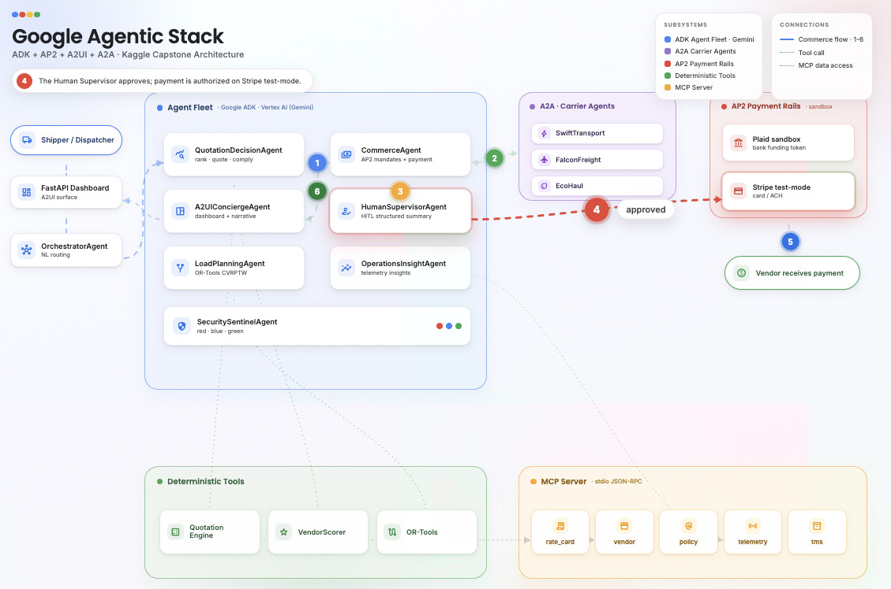
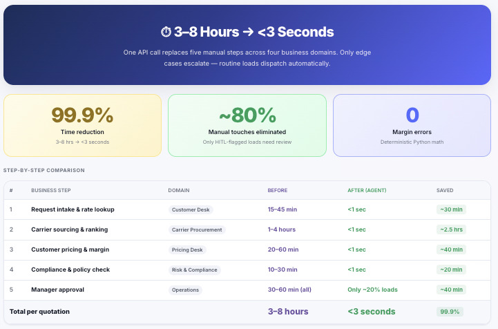
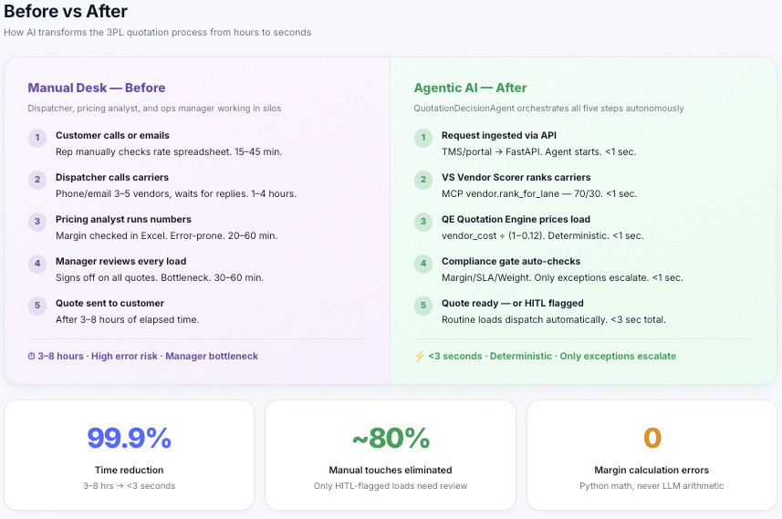
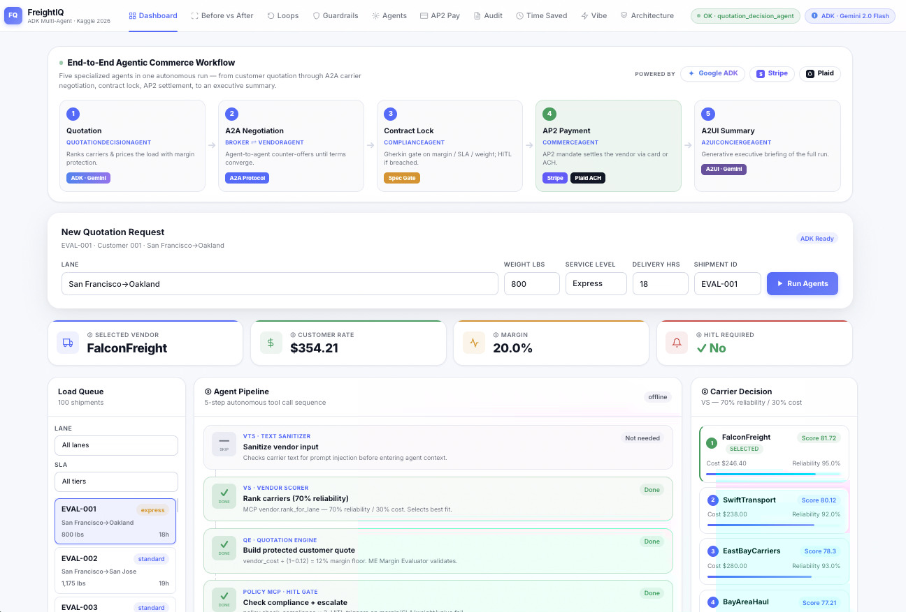
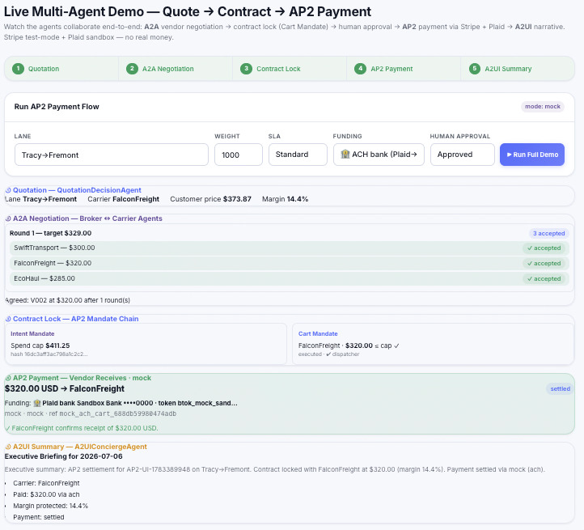
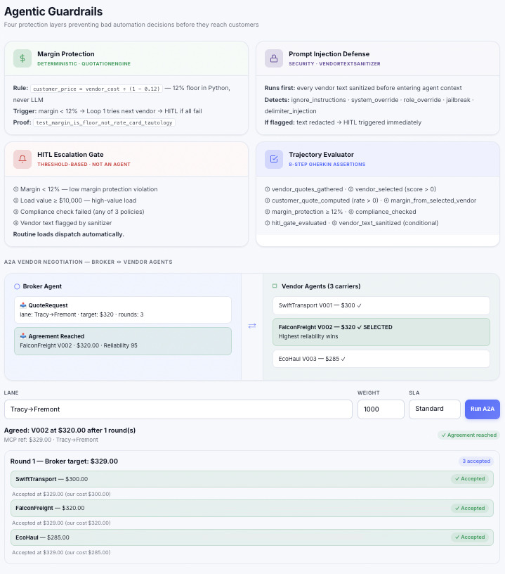
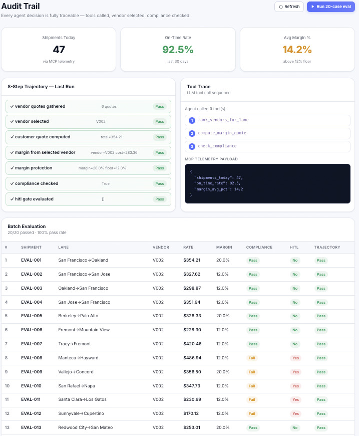
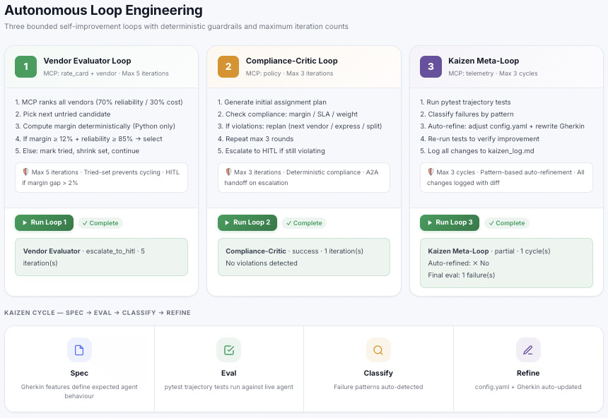
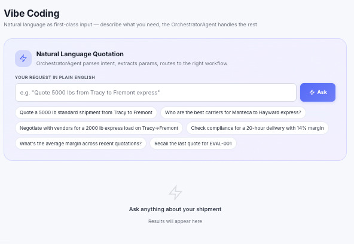
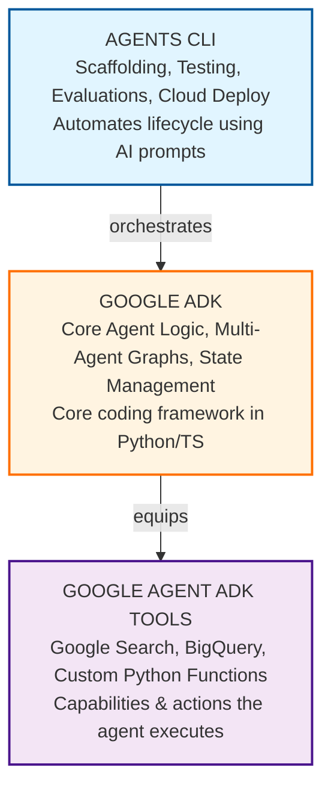

# FreightIQ - An Autonomous 3PL Multi-Agent Optimization System

**A production-grade multi-agent logistics system** where eight specialized agents
collaborate — from natural-language request to a quoted, negotiated, human-approved,
and **paid** freight contract — over **A2A**, **AP2**, and **A2UI**, on the Google Agent
stack (Google ADK · Vertex AI / Gemini · Agent CLI · MCP · Cloud Run).

> Built with **Antigravity IDE using **antigravity models**, **Google ADK**,
> **Google Agent CLI**, and deployed to **Google Cloud Run**.

> Watch it live: **Agents** tab → _▶ Play collaboration_, then **AP2 Pay** tab →
> pick Card/ACH → _▶ Run Full Demo_ (Quote → A2A → Contract → AP2 payment → A2UI summary).

---

## System Architecture
**Eight specialized agents collaborating through A2A, AP2, and A2UI protocols**



## ROI
**Time savings achieved through automated agent workflows**
**Comparison showing efficiency gains from multi-agent optimization**



## System Visualization
**Main dashboard UI showing agent collaboration and payment flows**


**AP2 payment flow showing intent/cart mandates and Stripe/Plaid integration**


**Security guardrails including margin floor, HITL gates, and payment safety**


**Audit trail demonstrating agent decision logging and compliance tracking**


**Three bounded autonomous loops for vendor evaluation, compliance, and kaizen**


**Natural language Quotation generation**


---

## What it does

1. **Quote** — rank carriers (70% reliability / 30% cost), price at a deterministic **12% margin floor**.
2. **Negotiate (A2A)** — broker ↔ carrier agents exchange counter-offers until they agree.
3. **Lock contract (AP2)** — Intent Mandate (spend cap) → Cart Mandate (agreed vendor + rate).
4. **Approve (HITL)** — HumanSupervisorAgent gives a structured summary; high-risk loads gate.
5. **Pay** — Stripe test-mode charge, funded by card or **Plaid-linked bank (ACH)** — the vendor receives it. _No real money._
6. **Present (A2UI)** — A2UIConciergeAgent narrates the whole run for the dashboard.

Plus **OperationsInsight** (bottlenecks/reliability/readiness), **LoadPlanning**
(real OR-Tools CVRPTW), and **SecuritySentinel** (red/blue/green) agents.

---

## The agents

Every agent loads its `.agy` specification + skill contracts at startup — the **three-layer harness**
(declaration → skill context → runtime) is consistent across all 8 agents.

| Agent                    | `.agy` file              | ADK harness                            | Responsibility                                                      |
| ------------------------ | ------------------------ | -------------------------------------- | ------------------------------------------------------------------- |
| `QuotationDecisionAgent` | `quotation_decision.agy` | `AdkAgent` + `InMemoryRunner` + Gemini | Vendor ranking, margin quote, compliance, HITL                      |
| `OrchestratorAgent`      | `orchestrator.agy`       | `AdkAgent` + `InMemoryRunner` + Gemini | Natural-language → workflow routing (Vibe)                          |
| `CommerceAgent`          | `commerce.agy`           | skill context (deterministic AP2)      | Intent/Cart mandates, negotiation, sandbox payment                  |
| `HumanSupervisorAgent`   | `human_supervisor.agy`   | skill context (deterministic gate)     | Structured HITL summaries (action, rationale, reversibility)        |
| `OperationsInsightAgent` | `operations_insight.agy` | skill context (heuristic + MCP)        | Bottlenecks, dwell prediction, vendor reliability, pallet readiness |
| `LoadPlanningAgent`      | `load_planning.agy`      | skill context (OR-Tools CVRPTW)        | Capacity + time-window route optimization                           |
| `A2UIConciergeAgent`     | `a2ui_concierge.agy`     | skill context (template presentation)  | Audience dashboards + narrative summaries                           |
| `SecuritySentinelAgent`  | `security_sentinel.agy`  | skill context (red/blue/green sim)     | Red / blue / green team testing + hardening                         |
| Vendor A2A Agents        | —                        | deterministic counter-offer logic      | Carrier-side negotiation                                            |

---

## Margin protection 

`customer_price = ceil(vendor_cost / (1 − 0.12))` computed from the **selected** vendor's
cost — rounded up to the cent so the 12% floor is never breached. Proven by
`test_margin_is_floor_not_rate_card_tautology`.

---

## Quickstart

```bash
uv sync                          # installs everything, incl. stripe + plaid (core deps)

# Run the tests (140, no network / no keys needed)
uv run pytest -q

# Launch the dashboard (http://localhost:9000)
uv run uvicorn frontend.cloudrun_app.app:app --host 0.0.0.0 --port 9000 --reload
```

Open the UI → **AP2 Pay** tab → _▶ Run Full Demo_. With no keys it runs a safe
**MockProcessor**; add sandbox keys for real Stripe/Plaid transactions.

---

## Live sandbox payments (fake money only)

```bash
cp .env.example .env
# in .env:  ALLOW_LIVE_PAYMENTS=1
#           STRIPE_API_KEY=sk_test_...          (test key only; sk_live_ is hard-blocked)
#           PLAID_CLIENT_ID=...  PLAID_SECRET=...  PLAID_ENV=sandbox  (production blocked)
#           PAYMENT_METHOD=ach   (optional; UI toggle overrides per-request)

uv run python scripts/verify_payments.py        # prints the Stripe pi_... + Plaid funding
```

Card charges show `succeeded`; ACH (Plaid → Stripe `us_bank_account`) shows `processing`
(ACH is asynchronous). Both appear in your **Stripe test dashboard → Payments**.

---

## API (selected)

`POST /api/dual-quote` · `POST /api/a2a-negotiate` · **`POST /api/ap2-payment`** ·
`POST /api/human-review` · `POST /api/load-plan` · `POST /api/operations-insight` ·
`POST /api/generate-narrative` · `POST /api/red-team-test` · `GET /health`.
Full list in [ARCHITECTURE.md](ARCHITECTURE.md).

```bash
curl -X POST http://localhost:9000/api/ap2-payment \
  -H 'Content-Type: application/json' \
  -d '{"lane":"Tracy->Fremont","weight":1000,"human_approved":true,"payment_method":"ach"}'
```

---

## Guardrails

- **12% margin floor** enforced in Python, never the LLM.
- **Human In The Loop (HITL)** gate blocks auto-dispatch on low margin, high value ≥ $10k, compliance failure, or prompt-injection flag.
- **AP2**: no charge without an approved Cart Mandate, and never above the Intent spend cap.
- **Payments**: live keys / production Plaid hard-blocked; default is a network-free mock.
- **Skills loader is strict** — a missing skill fails loud, not silently.

---

## Development environment

This project was built using **OpenCode** (antigravity IDE) with **antigravity models**,
**Google ADK**, **Google Agent CLI**, and **Google Cloud** throughout.

| Tool                                | Role in this project                                                            |
| ----------------------------------- | ------------------------------------------------------------------------------- |
| **Antigravity IDE**      | Primary development environment; agentic coding, refactoring, test generation   |
| **Antigravity models**              | LLM backbone for OpenCode-driven development sessions                           |
| **Google ADK** (`google-adk`)       | Agent framework: `LlmAgent`, `InMemoryRunner`, tool registration                |
| **Google Agent CLI** (`agents-cli`) | Scaffold, evaluate, and deploy the agent fleet                                  |
| **Google Vertex AI / Gemini**       | `gemini-2.0-flash` — routing, quoting, narratives; `gemini-1.5-pro` fallback    |
| **Google Cloud Run**                | Serverless production deployment (`deployment/cloudrun/`)                       |
| **Google Secret Manager**           | `GEMINI_API_KEY` injection at runtime (never baked into image)                  |
| **Google Cloud Build / CI**         | `.github/workflows/ci.yml` — test + lint + Docker build on push/PR              |
| **MCP** (Model Context Protocol)    | stdio JSON-RPC tool server: `rate_card`, `vendor`, `policy`, `telemetry`, `tms` |

---

## Tech stack

Google ADK · Agent CLI · Google Agent ADK Tools Vertex AI (Gemini 2.0 Flash) ·  MCP (stdio) · Cloud Run · Antigravity IDE · FastAPI · OR-Tools · Stripe (test) · Plaid (sandbox) · Pydantic · pytest · uv.



 ## Docs

- [ARCHITECTURE.md](ARCHITECTURE.md) — full system design, agents, harness, workflows, stack.
- [BUILD.md](BUILD.md) — Cloud Run build + deploy notes.
- [AGENTS.md](AGENTS.md) — developer reference for Antigravity IDE sessions.
- [COURSE-REVIEW.md](COURSE-REVIEW.md) — capability-by-capability review against the capstone spec.

---